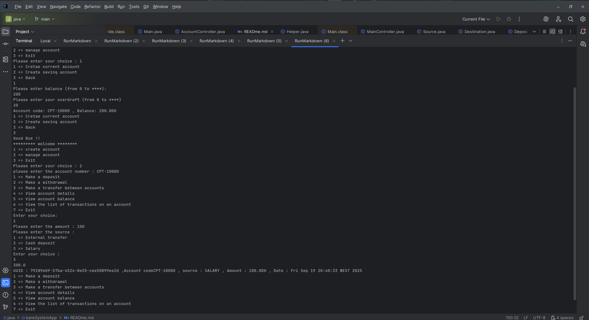

#  BanqueApp - Banking Account Management (Java 8)

##  Overview
BanqueApp is a **console-based banking application** developed in **Java 8**.  
It allows automated management of bank accounts and transactions such as deposits, withdrawals, and transfers.

The application follows a simplified **MVC-inspired architecture**, but only uses **Model + Controller (MC)**, since the console interface replaces the traditional View layer.  
All outputs and interactions are handled directly within controllers.

---

##  Architecture

###  Package Structure
```
src/
 ├── controller/
 │    ├── MainController.java
 │    ├── AccountController.java
 │    └── OperationController.java
 ├── model/
 │    ├── Compte.java (abstract)
 │    ├── CompteCourant.java
 │    ├── CompteEpargne.java
 │    ├── Operation.java (abstract)
 │    ├── Versement.java
 │    └── Retrait.java
 └── util/
      ├── ValidationUtils.java
      └── CodeGenerator.java
```

###  Controllers
- **MainController** → entry point, handles the main console menu.
- **AccountController** → account-related operations (create, consult, check balance).
- **OperationController** → transaction-related operations (deposit, withdrawal, transfer).

---

##  Business Model

### 🔹 Abstract Class `Compte`
- **Attributes**
    - `String code` → unique account code (format `CPT-XXXXX`)
    - `double solde` → account balance
    - `List<Operation> listeOperations` → list of performed operations

- **Abstract Methods**
    - `void retirer(double montant)`
    - `double calculerInteret()`
    - `void afficherDetails()`

---

### 🔹 `CompteCourant` (Current Account)
- **Extra attribute** : `double decouvert` (overdraft limit).
- **Withdrawal Rule** : balance ≥ `-decouvert`.
- **Interest** : always `0`.

---

### 🔹 `CompteEpargne` (Savings Account)
- **Extra attribute** : `double tauxInteret`.
- **Withdrawal Rule** : balance ≥ withdrawal amount.
- **Interest Calculation** : based on `tauxInteret`.

---

### 🔹 Abstract Class `Operation`
- **Attributes**
    - `UUID numero` → unique identifier
    - `LocalDateTime date` → operation date/time
    - `double montant` → transaction amount

---

### 🔹 `Versement` (Deposit)
- **Extra attribute** : `String source` (e.g., "Salary", "Cash Deposit").

### 🔹 `Retrait` (Withdrawal)
- **Extra attribute** : `String destination` (e.g., "ATM", "Check").

---

##  Features
-  Create account (current or savings)
-  Deposit into account
-  Withdraw from account
-  Transfer between accounts (reuses deposit & withdrawal logic)
-  Check account balance
-  List account operations

---

##  Technical Specifications
- **Collections** → `HashMap` for fast account lookup.
- **Dates** → handled using Java Time API (`LocalDateTime`).
- **Validations** → input checks (positive amounts, account code format).
- **Exception Handling** → `try/catch` blocks for safe execution.
- **Persistence** → in-memory only (data lost after shutdown).

---

##  Bonus (Optional Enhancements)
- Use **Stream API** for filtering and displaying accounts/operations.
- Advanced search by amount, date, or type of operation.

---

##  Run Instructions

### Run from JAR (pre-built)
run:
```bash
cd src/bankSystemApp_jar/
java -jar bankSystemApp.jar
```

##  Console Menu

```
==== BANK MENU ====
1. Create Account
2. Consult Account
3. Exit
          ├── 1. Create Account
          │      ├── 1. Current Account
          │      ├── 2. Saving Account
          │      └── 3. Return
          │
          ├── 2. Consult Account
          │      (requires entering an existing account number)
          │
          │      ├── 1. Make a Deposit
          │      │      ├── Source:
          │      │      │     ├── 1. External Transfer
          │      │      │     ├── 2. Cash Deposit
          │      │      │     └── 3. Salary
          │      │
          │      ├── 2. Make a Withdrawal
          │      │      ├── Destination:
          │      │      │     ├── 1. ATM
          │      │      │     ├── 2. Check
          │      │      │     └── 3. Transfer
          │      │
          │      ├── 3. Transfer Between Accounts
          │      │      └── (enter receiver account code & amount)
          │      │
          │      ├── 4. View Account Details
          │      ├── 5. View Account Balance
          │      ├── 6. View List of Operations
          │      └── 7. Return to Main Menu
          │
          └── 3. Exit
```

---

##  Author
**Ismail baoud**  
Full stack and Java Developer | Banking Systems Enthusiast  